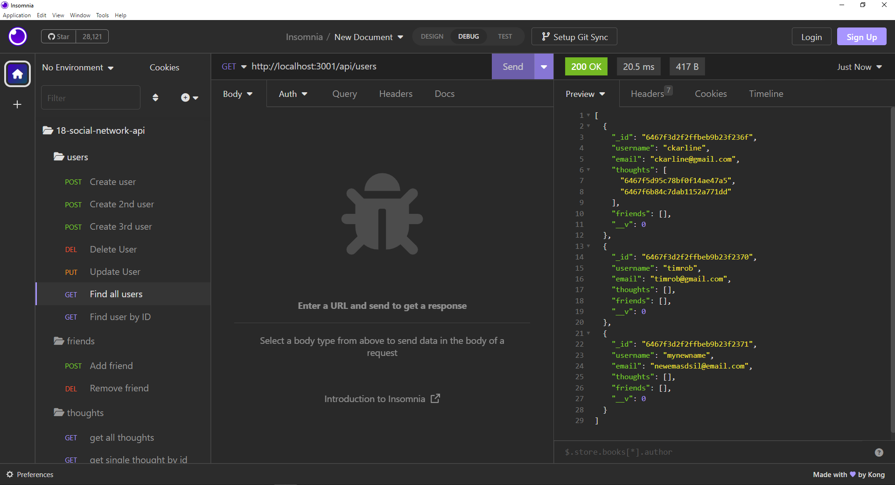
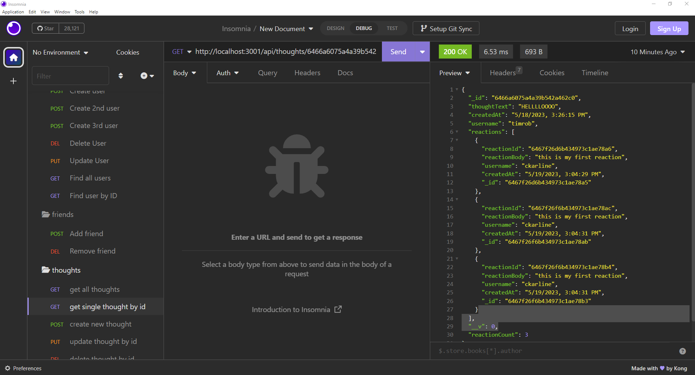

# 18-social-network-api
CRUD your thoughts and reactions with a basic social network API. Add friends and react to their thoughts.

## Description
This app uses node.js and mongoose to interface with the MongoDB database. 
A user can:
-Create/remove/update users
-Add/remove friend associations between users
-Add/remove/update thoughts (simple posts about a topic)
-Add/remove/update reactions (comments on a user's thoughts)

## Running the application
Install node.js, the dependecies and run server.js.

## Screenshots of the Application

## Repository and Video Demo

The video is available here: [video-demo](https://youtu.be/fc9kLdqZopw)
The repo is available here: [repo](https://github.com/cristino4/18-social-network-api)

